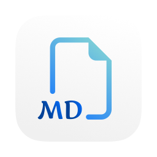

<h1> MyEditor</h1>

一个轻量的 macOS Markdown 阅读与编辑应用，支持正文与源码编辑、目录导航、全文搜索和 Mermaid 图表。

## 安装

[**下载 MyEditor.dmg**](https://github.com/sherl98/myeditor/releases/download/v2.0.0-preview.1/MyEditor.dmg)

打开 DMG，将 MyEditor 拖入 Applications，然后从“应用程序”启动。

需要 Apple Silicon Mac 和 macOS 26+。当前为预览版，尚未完成 Apple 公证。

## 致谢

感谢 [MarkEdit](https://github.com/MarkEdit-app/MarkEdit)、[CotEditor](https://github.com/coteditor/CotEditor)、[MiaoYan](https://github.com/tw93/MiaoYan) 和 [MarkupEditor](https://github.com/stevengharris/MarkupEditor) 提供的架构与工程参考。

编辑功能基于 [MDXEditor](https://github.com/mdx-editor/editor)、[Lexical](https://github.com/facebook/lexical)、[CodeMirror](https://github.com/codemirror/dev)、[Mermaid](https://github.com/mermaid-js/mermaid) 和 [React](https://github.com/facebook/react)。感谢这些项目的维护者与贡献者。

本项目由作者与 OpenAI Codex 协作开发。
